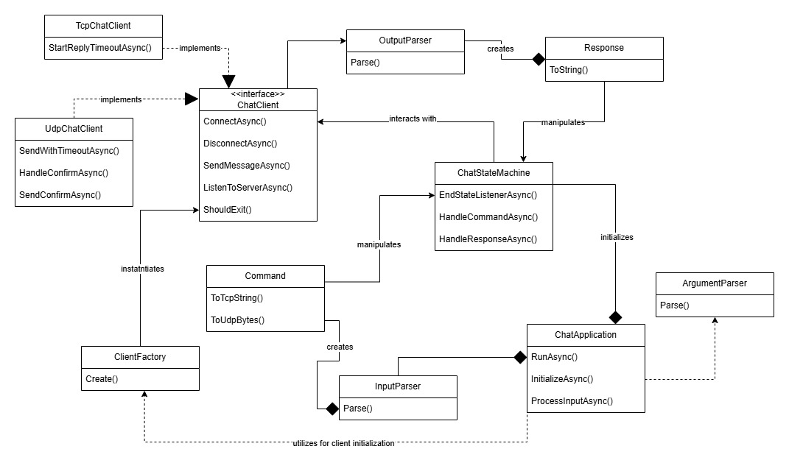
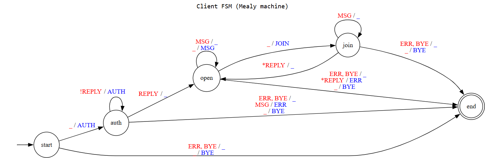
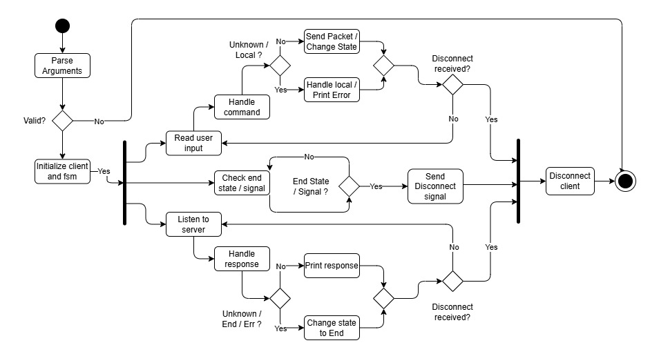
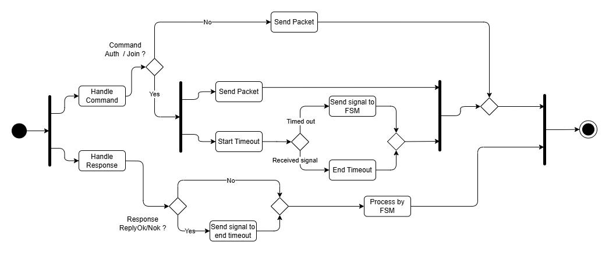
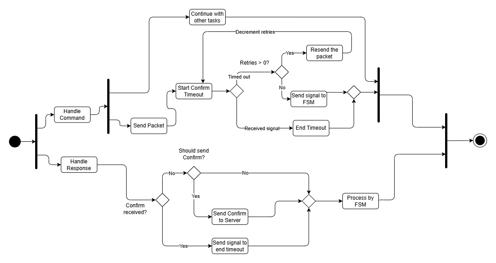
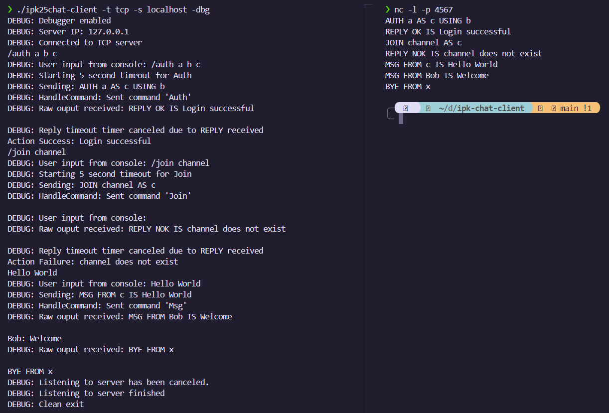
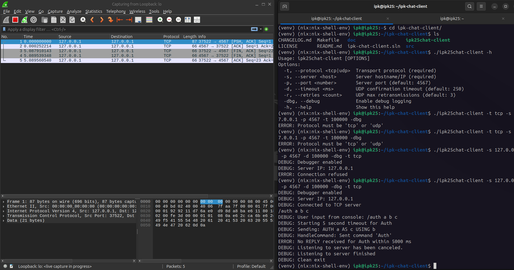
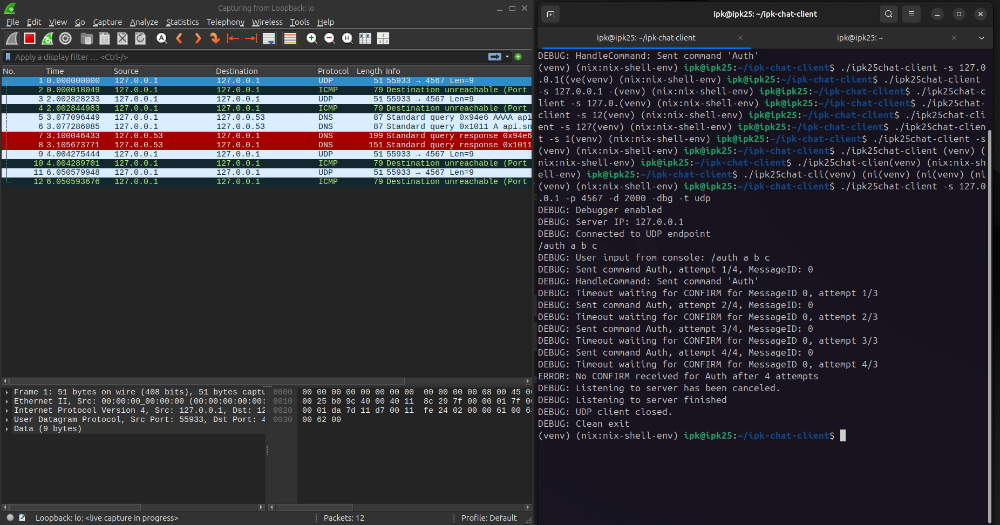

# IPK Chat Client
## Overview
Client application for remote server communication using IPK25-CHAT protocol written in C#.

## Table of Contents
- [Summary](#summary)
- [How to Use](#how-to-use)
  - [Argument Options](#argument-options)
  - [Command Options](#command-options)
- [Theory](#theory)
  - [General Theory](#general-theory)
    - [L4 (Transport Layer)](#l4-transport-layer)
    - [TCP](#tcp)
    - [UDP](#udp)
  - [Implementation Theory](#implementation-theory)
    - [TCP Messaging](#tcp-messaging)
    - [UDP Messaging](#udp-messaging)
    - [State Machine](#state-machine)
    - [IPK25-CHAT Protocol](#ipk25-chat-protocol)
- [Implementation Details](#implementation-details)
  - [Code Structure](#code-structure)
  - [Key Classes and Namespaces](#key-classes-and-namespaces)
  - [Class Diagram](#class-diagram)
  - [Finite State Machine](#finite-state-machine)
  - [Activity Diagram](#activity-diagram)
    - [Activty Diagram TCP](#activity-diagram-tcp)
    - [Activty Diagram UDP](#activity-diagram-udp)
  - [Supported Message Types](#supported-message-types)
    - [TCP Message Implementation](#tcp-message-implementation)
    - [UDP Message Implementation](#udp-message-implementation)
- [Testing](#testing)
  - [Manual Testing](#manual-testing)
    - [Testing using Netcat](#testing-using-netcat)
      - [TCP Netcat Testing](#tcp-netcat-testing)
      - [UDP Netcat Testing](#udp-netcat-testing)
    - [Testing using Wireshark](#testing-using-wireshark)
  - [Automated Tests](#automated-tests)
- [Bibliography](#bibliography)
  

## Summary
This application communicates with a remote server using the `IPK25-CHAT` protocol built on top of TCP/UDP transport protocols.
Key features:
- **TCP Support**: Reliable, text-based messaging.
- **UDP Support**: Binary messaging with confirmation and retransmission.
- **IPv4 Only**: Supports only IPv4 addressing.
- **Stateful Operation**: Uses a finite state machine for protocol compliance.
- **Flexible CLI**: Configurable via command-line arguments.

## Requirements
- .NET SDK 8.0+ (tested with 8.0 and 9.0)
- IPv4 network access
- Compatible with Linux (tests on WLS, Ubuntu and VM with custom environment)

## Installation
1. Clone the repository:
   ```shell
   git clone https://github.com/rm-a0/ipk-chat-client
   cd ipk-chat-client
   ```
2. Compile the source code using make or dotnet:
  ```shell
  make
  ```
  ```shell
  cd src
  dotnet build ipk25chat-client.csproj
  ```
3. Run the application directly or using dotnet:
  ```shell
  ./ipk25chat-client [OPTIONS] 
  ```
  ```shell
  dotnet run --project ipk25chat-client.csproj [OPTIONS]
  ```
## How to Use
When exectuing application user is required/allowed to specify different options
### Argument Options

| Argument         | Values                                          | Possible values        | Meaning or expected program behaviour
| ---------------- | ----------------------------------------------- | ---------------------- | -------------------------------------
| `-t` `--protocol`|  **User provided**                              | `tcp` or `udp`         | Transport protocol used for connection
| `-s` `---server` |  **User provided**                              | IP address or hostname | Server IP or hostname
| `-p` `--port`    | `4567`                                          | `uint16`               | Server port
| `-d` `--timeout` | `250`                                           | `uint16`               | UDP confirmation timeout (in milliseconds)
| `-r` `--retries` | `3`                                             | `uint8`                | Maximum number of UDP retransmissions
| `-h` `--help`    |                                                 |                        | Prints program help output and exits
| `-dbg` `--debug` |                                                 |                        | Enables debugging and displays logs during execution

### Command Options
After execution user can interact with CLI and input different commands

| Command     | Parameters                              | Client behaviour
| ----------- | --------------------------------------- | ----------------
| `/auth`     | `{Username}`&nbsp;`{Secret}`&nbsp;`{DisplayName}` | Sends `AUTH` message with the data provided from the command to the server (and correctly handles the `Reply` message), locally sets the `DisplayName` value (same as the `/rename` command)
| `/join`     | `{ChannelID}`                           | Sends `JOIN` message with channel name from the command to the server (and correctly handles the `Reply` message)
| `/rename`   | `{DisplayName}`                         | Locally changes the display name of the user to be sent with new messages/selected commands
| `/help`     |                                         | Prints out supported local commands with their parameters and a description

## Theory
### General Theory
#### L4 (Transport Layer)
- Manages end-to-end communication between applications.
- Uses ports (0-65535) to identify services.
- Protocols: **TCP** (connection-oriented, reliable) and **UDP** (connectionless, fast).

#### TCP
- **Connection-Based**: Establishes a connection via handshake.
- **Reliable**: Ensures delivery with retransmission and ordering.
- **Used Here**: Sends text-based commands (e.g., `AUTH`, `MSG`) terminated with `\r\n`.

#### UDP
- **Connectionless**: No session setup, just datagrams.
- **Unreliable**: No built-in delivery guarantees.
- **Used Here**: Sends binary messages with application-level confirmation.

### Implementation Theory
#### TCP Messaging
- **Mechanism**:
  - Utilizes .NET’s `TcpClient` to establish connection to the server.
  - Sends text-based messages compliant with the protocol’s ABNF grammar (e.g., `AUTH user AS User USING secret\r\n`).
- **Reliability**: Relies on TCP’s built-in guarantees for ordered, error-free delivery ([RFC 9293](https://datatracker.ietf.org/doc/html/rfc9293)).
- **Termination**: Ensures graceful termination without the `RST` flag on receiving `BYE` or user interrupt (e.g., Ctrl+C), per spec requirements.

#### UDP Messaging
- **Mechanism**:
  - Utilizes `UdpClient` to send binary messages with a 3-byte header (`Type` as `uint8`, `MessageID` as `uint16`) followed by zero-terminated strings.
  - Implements application-level confirmation with a 250ms timeout and up to 3 retries for unconfirmed messages (can be configured).

- **Reliability**:
  | Issue         | Solution                     |
  |---------------|------------------------------|
  | Packet Loss   | Retransmits after timeout    |
  | Duplication   | Tracks `MessageID` to ignore duplicates| 
  | Reordering    | Processes all messages, confirms once |

#### State Machine
- **Mealy FSM**: Drives client behavior with transitions based on server inputs (e.g., `REPLY`) and client outputs (e.g., `AUTH`).
- **States**: `start`, `auth`, `join`, `open`, `end`.
- **Key Behaviors**:
  - `AUTH` initiates authentication, expecting a `REPLY` to proceed.
  - `JOIN` is optional after automatic default channel assignment after authentication.
  - `ERR` or `BYE` triggers transition to `end`, followed by graceful connection termination.

#### IPK25-CHAT Protocol
This protocol builds on the TCP and UDP variants described above, defining a chat application framework with message types like `AUTH`, `MSG`, and `BYE`. It supports IPv4-only communication on a default port of 4567. For comprehensive details, refer to the original [project specification document](https://git.fit.vutbr.cz/NESFIT/IPK-Projects/src/branch/master/Project_2/README.md) provided by the IPK course at FIT VUT.

## Implementation Details
### Code Structure
```
src/
├── Core/
│   ├── ArgumentParser.cs     # CLI argument parsing
│   ├── ChatApplication.cs    # Main logic
│   ├── ChatStateMachine.cs   # FSM implementation
├── Debug/
│   ├── Debugger.cs           # Logging utilities
├── IO/
│   ├── Command.cs            # Command structure
│   ├── InputParser.cs        # User input parsing into command objects
│   ├── OutputParser.cs       # Server output parsing into repsponse objects
│   ├── Response.cs           # Response structure
├── Network/
│   ├── ChatClient.cs         # Client intraface
│   ├── ClientFactory.cs      # Client instantiation
│   ├── TcpChatClient.cs      # TCP client
│   ├── UdpChatClient.cs      # UDP client
├── GlobalUsing.cs            # Global usings (Common namespaces used globally)
├── Program.cs                # Entry point
├── ipk25chat-client.csproj   # Project file
```
### Key Classes and Namespaces
- **Core**: Contains the core logic of the application.
  - `ArgumentParser`: Handles parsing of command-line arguments.
  - `ChatApplication`: Responsible for the main application flow and organization.
  - `ChatStateMachine`: Manages state transitions for the chat protocol using a finite state machine.
- **Debug**: Provides debugging support.
  - `Debugger`: Contains utilities for logging and debugging the application.
- **IO**: Manages input and output processing.
  - `Command`: Represents the structure of user commands.
  - `InputParser`: Converts user input into `Command` objects.
  - `OutputParser`: Converts server responses into `Response` objects.
  - `Response`: Defines the structure of server responses.
- **Network**: Handles network communication.
  - `ChatClient`: An abstract interface defining client communication methods.
  - `ClientFactory`: Instantiates the appropriate client (`TcpChatClient` or `UdpChatClient`).
  - `TcpChatClient`: Implements TCP-based communication with the server.
  - `UdpChatClient`: Implements UDP-based communication with the server.


### Class Diagram
The class diagram shows the main system components and how they interact between each other.

> **Note**: Attributes and helper methods were omitted to keep the diagram clear and focused on the key methods and interactions.

### Finite State Machine
The finite state machine describes the client's behavior and state transitions based on the input/output sent/received. Protocol specific messages (e.g., Ping or Confirm) need to be handled by specific `ChatClient` implementations. This design promotes extensibility and makes the application easier to expand when supporting additional client types built on top of `IPK25-CHAT` protocol. 

- **Blue Values** - client-sent messages (Command)
- **Red Values** - server-sent messages (Response)

| Symbol | Meaning                |
|--------|------------------------|
| `_`    | No message             |  
| `*`    | All possible messages  |
| `!`    | Negative message       |


>**Note**: The FSM implemented is identical to the one provided in the original project specification, therefore, the original image is used.

### Activity Diagram
This activity diagram illustrates parallel processes and concurrent tasks within the system.

> **Note**: Some system details were omitted to make the diagram easier to understand. It shows the main parallel tasks in a clear, high-level way.

#### Activity Diagram TCP
The TCP activity diagram illustrates parallel timeout mechanism implemented for TCP variant.


#### Activity Diagram UDP
The UDP activity diagram illustrates parallel retry and confirm mechanism implemented for UDP variant.


> **Note**: These diagrams focus only on the timeout/confirm-retry handling part of the system. FSM signal handling and other potential interruptions were left out to keep it simple and easy to understand. If you are not familiar with Activity Diagrams containing Forks refer to the [UML Activity Diagram documentation](https://www.uml-diagrams.org/activity-diagrams-controls.html).

### Supported Message Types
The application currently supports the following message types. 

| Type Name | Direction         | Description                                                |
|-----------|-------------------|------------------------------------------------------------|
| `AUTH`    | Client → Server   | Authenticates a user using a username and password.        |
| `JOIN`    | Client → Server   | Requests to join a specific chat channel.                  |
| `REPLY`   | Server → Client   | Provides a response to a `Join` or `Auth` requests.        |
| `ERR`     | Bidirectional     | Indicates an error and triggers graceful termination.      |
| `MSG`     | Bidirectional     | Sends a chat message to a joined channel.                  |
| `BYE`     | Bidirectional     | Terminates the connection.                                 |
| `CONFIRM` | Bidirectional     | Confirms successful delivery (UDP only).       |
| `PING`    | Server → Client   | Aliveness check sent periodically (UDP only).              |

#### TCP Message Implementation
Bellow is a table containing structure of all message types supported by TCP variant.

| Message type | Message parameter template|
| ------------ | --------------------------
| `ERR`        | `ERR FROM {DisplayName} IS {MessageContent}\r\n`
| `REPLY`      | `REPLY {"OK"\|"NOK"} IS {MessageContent}\r\n`
| `AUTH`       | `AUTH {Username} AS {DisplayName} USING {Secret}\r\n`
| `JOIN`       | `JOIN {ChannelID} AS {DisplayName}\r\n`
| `MSG`        | `MSG FROM {DisplayName} IS {MessageContent}\r\n`
| `BYE`        | `BYE FROM {DisplayName}\r\n`

#### UDP Message Implementation
Bellow is a table containing structure of all message types supported by UDP variant.

| Message Type | Type (Hex) | MessageID | Ref_MessageID | Result | Username | DisplayName | Secret | ChannelID | MessageContents |
|--------------|------------|-----------|---------------|--------|----------|-------------|--------|-----------|-----------------|
| `CONFIRM`    | 0x00       | (2B)      | (2B)          | –      | –        | –           | –      | –         | –               |
| `REPLY`      | 0x01       | (2B)      | (2B)          | (1B)   | –        | –           | –      | –         | (string\0)      |
| `AUTH`       | 0x02       | (2B)      | –             | –      | (string\0) | (string\0)  | (string\0) | –         | –               |
| `JOIN`       | 0x03       | (2B)      | –             | –      | –        | (string\0)  | –      | (string\0) | –               |
| `MSG`        | 0x04       | (2B)      | –             | –      | –        | (string\0)  | –      | –         | (string\0)      |
| `PING`       | 0xFD       | (2B)      | –             | –      | –        | –           | –      | –         | –               |
| `ERR`        | 0xFE       | (2B)      | –             | –      | –        | (string\0)  | –      | –         | (string\0)      |
| `BYE`        | 0xFF       | (2B)      | –             | –      | –        | (string\0)  | –      | –         | –               |


### Testing
#### Manual Testing
Manual tests were the main method used for testing and validating protocol requirements during development. Tools used for manual testing included Wireshark and Netcat. Wireshark was employed to monitor packets sent/received to/from the server and Netcat was used to verify correct command/reply formating.
#### Testing using Netcat
##### TCP Netcat Testing
Testing TCP variant with Netcat was straightforward and required no additional setup.
In first terminal window `nc` command was executed and in the second terminal the `ipk25chat-client` binary was executed.

- Example input

| Terminal 1: Chat Client                      | Terminal 2: Netcat Listener                |
|----------------------------------------------|--------------------------------------------|
| ./ipk25chat-client -t tcp -s localhost       | nc -l -p 4567                              |
| /auth a b c                                  | REPLY OK IS Joined room                    |
| /join room                                   | MSG FROM Server IS Hello                   |
| Hello World                                  |                                            |
| /bye                                         |                                            | 

- Expected output

| Terminal 1: Chat Client                      | Terminal 2: Netcat Listener                |
|----------------------------------------------|--------------------------------------------|
| ./ipk25chat-client -t tcp -s localhost       | nc -l -p 4567                              |
| Action Success: Joined room                  | AUTH a AS c USING b                        |
| Server: Hello                                | JOIN room AS c                             |
|                                              | MSG FROM c IS Hello World                  |
|                                              | BYE FROM c                                 |

Bellow is a screenshot with debug logs to demonstrate testing process.

##### UDP Netcat Testing
For UDP testing additional setup was required. It was necessary to prepare `.bin` files and then pipe them into netcat.
- Message setup
```shell
echo "___Authentication OK_" | xxd >msg0_reply_auth.hex
xxd -r msg0_reply_auth.hex > msg0_reply_auth.bin
echo "___Joined successfully_" | xxd >msg0_reply_join.hex
xxd -r msg1_reply_join.hex > msg0_reply_join.bin
echo "___Alice_Hello there_" | xxd >msg2_msg.hex
xxd -r msg2_msg.hex > msg2_msg.bin
```
- Confirm response setup
```shell
echo "000000" | xxd -r -p > confirm0.bin
echo "000001" | xxd -r -p > confirm1.bin
echo "000002" | xxd -r -p > confirm2.bin
```
Since the application supports dynamic port changing, `lsof` command was used to find the port `ipk25chat` is connected to.
```shell
lsof -i -n -P | grep ipk25chat
```

- Example input

| Terminal 1: Chat Client                                   | Terminal 2: Netcat Listener     | Terminal 3: Netcat Pipe                            | 
|-----------------------------------------------------------|---------------------------------|----------------------------------------------------|
| ./ipk25chat-client -t udp -s localhost -d 10000 -r 3 -dbg | lsof -i -n -P \ grep ipk25chat  | nc -4 -u -v 127.0.0.1 {port} < confirm0.bin        |
| /auth a b c                                               | nc -u 127.0.0.1 {port}          | nc -4 -u -v 127.0.0.1 {port} < msg0_reply_auth.bin |
| /join channel                                             |                                 | nc -4 -u -v 127.0.0.1 {port} < confirm1.bin        |
| /bye                                                      |                                 | nc -4 -u -v 127.0.0.1 {port} < msg0_reply_join.bin |
|                                                           |                                 | nc -4 -u -v 127.0.0.1 {port} < confirm2.bin        |

- Expected output

| Terminal 1: Chat Client                                   | Terminal 2: Netcat Listener     | Terminal 3: Netcat Pipe                            | 
|-----------------------------------------------------------|---------------------------------|----------------------------------------------------|
| Action Success: Authentication OK                         |                                 ||
| Action Success: Joined successfull                        |                                 ||
| Alice: Hello there                                        |                                 ||

> **Note:** Netcat Listener for UDP is terminal dependant, meaning that the output will be different (e.g on ZSH (on WSL) '/auht a b c' shows as 'abc' but on XFCE (on Debian) it shows as '........a...b....c'). Some terminals discard unknown characters, some display them as '.' or '?'.

#### Testing using Wireshark
Wireshark was primarily used to verify the correct number and types of packets transmitted and received. It proved especially usefull for confirming UDP retry and confirm behavior, as well as validating the structure of binary messages. Below are screenshots from Wireshark sessions monitoring packet transmission.



#### Automated Tests
For final automatic testing and verification, external tests provided by one of the students were used. These tests can be found on their [github](https://github.com/Vlad6422/VUT_IPK_CLIENT_TESTS). Refer to the original documentation in the repository for usage instructions and concrete test implementation.
The tests verify basic client functionality such as correct CL argument parsing, UDP/TCP command/response formatting, different timeout scenarios and some additional edge cases such as multiple messages in one packet, message reassembling and user input interruption.

- **Test input:**
The `ipk25chat-client` binary.
- **Test results:**
As of 19 April 2025 (latest commit to the test repository was 17.4.2025), 50/55 have passed successfully.

> **Note for clarification:** I am not the author of the external tests and did not contribute to their development. All credit goes to the author of these tests.
> As mentioned in the original project specification, it is not recommended to use external tests. Despite that, these tests fall under MIT license and
upon further inspection, the tests correctly verify projects specification and there is no reason to avoid mentioning them in the documentation. The primary testing mainly relied on previously mentioned methods (Netcat and Wirsehark) and these automated tests were used only as a final validation.

### Bibliography
[RFC791] Postel, J. Internet Protocol [online]. September 1981. [cited 2025-04-19]. DOI: 10.17487/RFC791. Available at: https://datatracker.ietf.org/doc/html/rfc791

[RFC768] Postel, J. User Datagram Protocol [online]. August 1980. [cited 2025-04-19]. DOI: 10.17487/RFC0768. Available at: https://datatracker.ietf.org/doc/html/rfc768

[RFC9293] Allman, M., and Paxson, V. Transmission Control Protocol (TCP) [online]. August 2022. [cited 2025-04-19]. DOI: 10.17487/RFC9293. Available at: https://datatracker.ietf.org/doc/html/rfc9293

[RFC2119] Bradner, S. Key words for use in RFCs to Indicate Requirement Levels [online]. March 1997. [cited 2025-04-19]. DOI: 10.17487/RFC2119. Available at: https://datatracker.ietf.org/doc/html/rfc2119

[RFC5234] Crocker, D., and Overell, G. Augmented BNF for Syntax Specifications: ABNF [online]. January 2008. [cited 2025-04-19]. DOI: 10.17487/RFC5234. Available at: https://datatracker.ietf.org/doc/html/rfc5234

[IPK25-CHAT-SPEC] Faculty of Information Technology, Brno University of Technology. Project Specification – IPK25-CHAT Protocol [online]. [cited 2025-04-19]. Available at: https://git.fit.vutbr.cz/NESFIT/IPK-Projects/src/branch/master/Project_2/README.md

[Wireshark] The Wireshark Foundation. Wireshark Network Protocol Analyzer [online]. Available at: https://www.wireshark.org/

[Netcat] The Nmap Project. Netcat (nc) - TCP/IP Swiss Army Knife [online]. Available at: https://nmap.org/ncat/

[Vlad6422] Vladislav Zavadil. IPK Client Test Suite [online]. April 2025. [cited 2025-04-19]. Available at: https://github.com/Vlad6422/VUT_IPK_CLIENT_TESTS

> **Note** For few parts of this documentation (such as table of contents generation, bibliography formating and source research) generative AI was used. Also for better sentence structuring and grammar checking Overleaf built-in ai-powered tools were utilized (they are not part of generative AI models and only offer context-aware corrections and improvements to enhance writing quality and readability).
> When it comes to code, AI was used only as an assistant (to help understand concepts like canceltation tokens and built in .NET utilities) and no part of the actual source code (unless stated otherwise in the file) was fully copy-pasted from LLM, either it was heavily adjusted or enteierly rewritten.